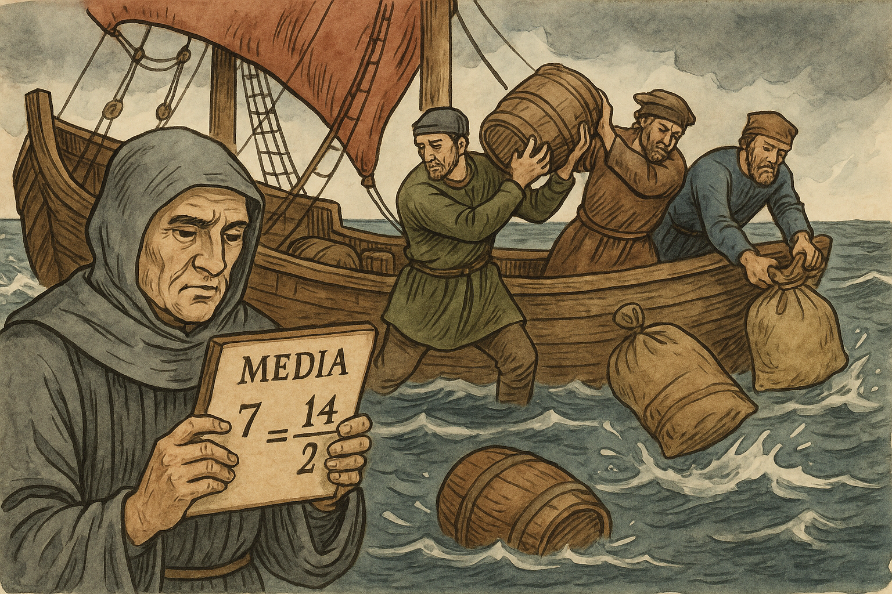
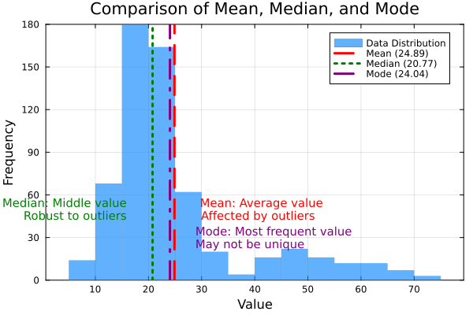

Uma das principais medidas de tendência central em estatística, a média aritmética é fundamental para análise de dados e interpretação estatística.

## O que é a Média Aritmética?

A média aritmética é a medida de tendência central mais utilizada e conhecida. Ela representa o valor que mostra para onde os dados tendem a se agrupar, ou seja, o ponto de equilíbrio de um conjunto de valores.

### Origem e História

O termo "aritmética" tem suas raízes no termo latino *arithmetica*, que deriva das palavras gregas `ἀριθμός (arithmos)`, que significa **número**, e `ἀριθμητική τέχνη (arithmetike tekhne)`, que significa **a arte de contar**.

A palavra "média" tem uma etimologia curiosa e multifacetada, enraizada tanto no comércio marítimo quanto na matemática. Sua origem remonta ao latim medieval `avaria`, termo usado no contexto das viagens comerciais marítimas no Mediterrâneo dos séculos XII e XIII para designar danos, perdas ou despesas extraordinárias sofridas durante uma travessia. Quando mercadorias precisavam ser descartadas ao mar para salvar o navio, os prejuízos eram distribuídos proporcionalmente entre todos os comerciantes envolvidos. Essa prática jurídica deu origem ao conceito de avaria grossa (general average, em inglês), onde cada parte contribuía com uma parte proporcional da perda.

<figure style="display: flex; flex-direction: column; align-items: center; margin: 2.5em 0 2em 0;">
  
  <figcaption class="img-caption-contrast">
    <strong>Figura:</strong> Representação visual da etimologia e evolução histórica do conceito de <b>média</b>. 
    A ideia de repartir perdas proporcionalmente no comércio marítimo influenciou o surgimento do conceito estatístico de média como valor intermediário.
  </figcaption>
</figure>

A **média aritmética** é um dos conceitos mais antigos e amplamente utilizados em estatística e matemática. Sua origem remonta aos antigos babilônios e gregos, que usavam a média para calcular taxas e proporções em problemas cotidianos. Ao longo da história, a média se tornou uma ferramenta fundamental para resumir conjuntos de dados e entender tendências centrais.

Embora a média aritmética seja frequentemente usada para relatar tendências centrais, ela não é uma estatística robusta: **é muito influenciada por valores discrepantes** (valores muito maiores ou menores do que a maioria dos outros).

### Definição

> A média aritmética de um conjunto de dados observados é igual à soma dos valores numéricos de cada observação, dividida pelo número total de observações.

Em outras palavras, a média aritmética é o **valor central** de um conjunto de dados, calculado pela soma de todos os valores dividida pela quantidade de valores. Ela fornece uma medida simples da "tendência central" dos dados.

Em termos simples, a média é calculada somando-se todos os valores de um conjunto de dados e dividindo-se pelo número total de elementos.

### Fórmula da Média Aritmética

$$\bar{x} = \frac{\sum_{i=1}^{n} x_i}{n}$$

Onde:
* $\bar{x}$ (lê-se "x barra") = média aritmética
* $\sum_{i=1}^{n} x_i$ = soma de todos os valores do conjunto
* $n$ = número total de elementos no conjunto

## Tipos de Média

### Média Aritmética Simples

É a média convencional, onde todos os valores têm o mesmo peso no cálculo.

**Exemplo:** Para o conjunto {2, 4, 6, 8, 10}

Média = (2 + 4 + 6 + 8 + 10) ÷ 5 = 30 ÷ 5 = 6

### Média Aritmética Ponderada

Neste tipo de média, cada valor tem um peso diferente no cálculo final.

$$\bar{x} = \frac{\sum_{i=1}^{n} x_i \cdot w_i}{\sum_{i=1}^{n} w_i}$$

Onde $w_i$ representa o peso de cada valor.

**Exemplo:** Cálculo de média final com pesos diferentes para provas

Prova 1: nota 7,0 (peso 2)  
Prova 2: nota 8,0 (peso 3)  
Prova 3: nota 9,0 (peso 5)

Média Ponderada = (7×2 + 8×3 + 9×5) ÷ (2+3+5) = (14 + 24 + 45) ÷ 10 = 83 ÷ 10 = 8,3

### Média Geométrica

A média geométrica é usada principalmente para conjuntos de valores positivos e para taxas de crescimento (como juros compostos, crescimento populacional, etc.).

$$M_g = \sqrt[n]{x_1 \cdot x_2 \cdot \ldots \cdot x_n}$$

**Exemplo:** Para os valores 2, 8 e 32:

Média geométrica = $(2 \times 8 \times 32)^{1/3} = (512)^{1/3} = 8$

> **Nota:** A média geométrica só é definida para números positivos.

### Média Harmônica

A média harmônica é especialmente útil para médias de razões, como velocidade média em trajetos com diferentes velocidades.

$$M_h = \frac{n}{\sum_{i=1}^{n} \frac{1}{x_i}}$$

**Exemplo:** Um carro percorre duas distâncias iguais a 60 km, uma a 30 km/h e outra a 60 km/h. Qual a velocidade média?

Média harmônica = $\frac{2}{\frac{1}{30} + \frac{1}{60}} = \frac{2}{\frac{2+1}{60}} = \frac{2}{\frac{3}{60}} = 40$ km/h

> **Nota:** A média harmônica é sempre menor ou igual à média aritmética.

### Média Quadrática (ou RMS)

A média quadrática é usada para medir a magnitude média de um conjunto de números, especialmente em física e engenharia (ex: corrente alternada).

$$M_q = \sqrt{\frac{1}{n}\sum_{i=1}^{n} x_i^2}$$

**Exemplo:** Para os valores 3, 4 e 5:

Média quadrática = $\sqrt{\frac{3^2 + 4^2 + 5^2}{3}} = \sqrt{\frac{9+16+25}{3}} = \sqrt{\frac{50}{3}} \approx 4,08$

> **Nota:** A média quadrática é sempre maior ou igual à média aritmética.

---

### Média Móvel

A média móvel é uma ferramenta estatística utilizada para suavizar flutuações em séries temporais, facilitando a identificação de tendências ao longo do tempo. É muito utilizada em análise de dados financeiros, economia, meteorologia e controle de qualidade.

**Definição:**

A média móvel de ordem $k$ é calculada tirando a média dos últimos $k$ valores de uma série de dados, deslocando essa janela ao longo do tempo.

**Fórmula:**

$$MM_t = \frac{x_{t} + x_{t-1} + \ldots + x_{t-k+1}}{k}$$

Onde:
- $MM_t$ = média móvel no tempo $t$
- $k$ = número de períodos da janela
- $x$ = valores da série

**Exemplo:**

Considere a série: 10, 12, 14, 16, 18, 20

Média móvel de ordem 3:
- 1ª média: (10 + 12 + 14) / 3 = 12
- 2ª média: (12 + 14 + 16) / 3 = 14
- 3ª média: (14 + 16 + 18) / 3 = 16
- 4ª média: (16 + 18 + 20) / 3 = 18

Portanto, a sequência de médias móveis é: **12, 14, 16, 18**

**Aplicações Comuns:**
- Análise de tendências em séries financeiras (ex: preços de ações)
- Suavização de dados meteorológicos (ex: temperatura média)
- Controle de qualidade industrial

> **Nota:** A escolha do valor de $k$ (tamanho da janela) afeta o quanto a série será suavizada: janelas maiores suavizam mais, mas podem atrasar a identificação de mudanças rápidas na tendência.

### Resumo Visual

| Tipo                | Fórmula Principal                                      | Aplicação Comum                      |
|---------------------|-------------------------------------------------------|--------------------------------------|
| Aritmética Simples  | $\bar{x} = \frac{\sum x_i}{n}$                        | Dados gerais                         |
| Aritmética Ponderada| $\bar{x} = \frac{\sum x_i w_i}{\sum w_i}$             | Notas, médias com pesos              |
| Geométrica          | $M_g = \sqrt[n]{x_1 x_2 ... x_n}$                     | Crescimento, taxas                   |
| Harmônica           | $M_h = \frac{n}{\sum \frac{1}{x_i}}$                 | Razões, velocidades médias           |
| Quadrática (RMS)    | $M_q = \sqrt{\frac{1}{n}\sum x_i^2}$                 | Física, engenharia                   |

### Propriedades da Média

* **Influência de valores extremos:** A média é sensível a valores extremos (outliers). Um valor muito alto ou muito baixo pode distorcer significativamente o resultado.
* **Representatividade:** A média nem sempre representa bem um conjunto de dados com distribuição assimétrica.
* **Unicidade:** Para um conjunto de dados, existe apenas uma média aritmética.
* **Valor intermediário:** A média sempre está entre o valor mínimo e o valor máximo do conjunto.

## Limitações da Média

Embora seja uma medida amplamente utilizada, a média apresenta algumas limitações:

* É fortemente influenciada por valores extremos (outliers)
* Não representa bem conjuntos com distribuição assimétrica
* Pode resultar em um valor que não existe no conjunto original
* Não fornece informações sobre a dispersão dos dados

Por isso, é importante considerar outras medidas de tendência central, como a [mediana](mediana.html) e a [moda](moda.html), para uma análise mais completa.

## Notas Importantes

- Sempre escolha o tipo de média mais adequado ao contexto do problema.
- A média aritmética pode ser enganosa em dados com muitos extremos (outliers).
- A média geométrica não é adequada para valores negativos ou zero.
- A média harmônica é ideal para médias de taxas (ex: velocidade, produtividade).
- A média quadrática é útil quando se deseja dar mais peso a valores maiores.

---

<figure style="display: flex; flex-direction: column; align-items: center; margin: 2.5em 0 2em 0;">
  
  <figcaption class="img-caption-contrast">
    <strong>Figura:</strong> Comparação gráfica entre <b>média</b>, <b>mediana</b> e <b>moda</b> em uma distribuição assimétrica. 
    A <b>média</b> é puxada na direção dos valores extremos (cauda), enquanto a <b>mediana</b> representa o valor central e a <b>moda</b> indica o valor mais frequente.
  </figcaption>
</figure>

## Curiosidade

- Para dois valores positivos quaisquer: Média harmônica ≤ Média geométrica ≤ Média aritmética ≤ Média quadrática.
- Esse resultado é conhecido como desigualdade das médias.

## Calculadora de Média

    <h3 style="margin-top: 0; color: #0066cc;">Calcule a média aritmética</h3>
    
Insira os valores separados por vírgula:

    

        <input type="text" id="data-input" placeholder="Ex: 10, 15, 20, 25, 30" 
               style="width: 100%; padding: 10px; border: 1px solid #ddd; border-radius: 4px; font-size: 16px;">
    

    <button id="calculate-btn" onclick="calculateMean()" 
            style="background-color: #0066cc; color: white; border: none; padding: 10px 15px; 
                   border-radius: 4px; cursor: pointer; font-weight: bold;">
        Calcular Média
    </button>
    

        
Média: -

    

